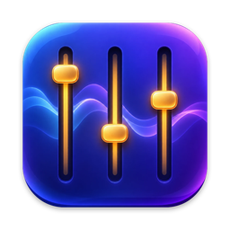

<h1 align="center">Undertone</h1>

Per-app volume control for your Mac's menu bar.

<a href="https://github.com/SkirnirStudios/Undertone/releases/latest"><b>⬇︎ Download the latest version</b></a>

---

macOS has one volume slider for everything. Undertone gives every app its own.

- **Per-app volume** from 0 to 200%, plus mute
- **Per-app output**: music on the speakers, calls in your AirPods
- **Auto-ducking**: other apps fade down while you're on a call
- **Shortcuts**: scroll over an app to adjust it, or use ⌃⌥⌘↑ / ⌃⌥⌘↓ / ⌃⌥⌘M for the app in front
- Live level meters, smooth fades, and a soft limiter so boosted audio stays clean
- Automatic updates

Apps you leave at 100% aren't touched at all, so they get no added delay.

## Install

1. Download the `.dmg` from the [latest release](https://github.com/SkirnirStudios/Undertone/releases/latest) and drag **Undertone** to **Applications**.
2. Open it. Undertone lives in the menu bar (the slider icon), not the Dock.
3. Click **Allow Access** when asked. macOS calls this *System Audio Recording*: it's how Undertone passes an app's sound through its volume control. Nothing is recorded, saved or sent anywhere.

Requires macOS 14.2 (Sonoma) or later, on Apple silicon or Intel. Undertone is signed and notarized by Apple.

## Privacy

Undertone doesn't collect any data. The only time it goes online is to check this page for updates, which you can turn off in its settings menu.

## Uninstall

Choose **Quit Undertone** from its settings menu (the gear), then drag it from Applications to the Trash.

## Feedback

Found a bug or have an idea? [Open an issue](https://github.com/SkirnirStudios/Undertone/issues).
